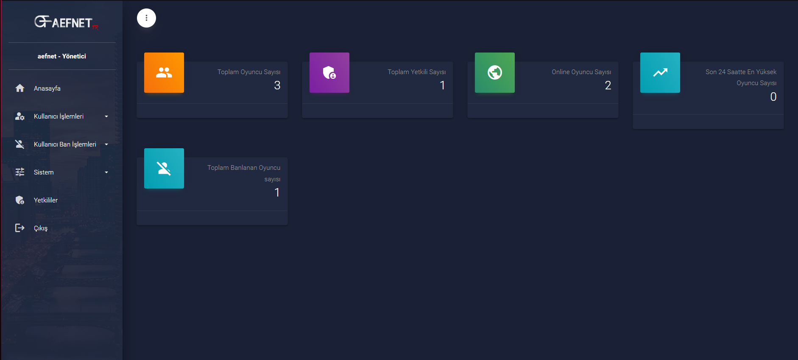
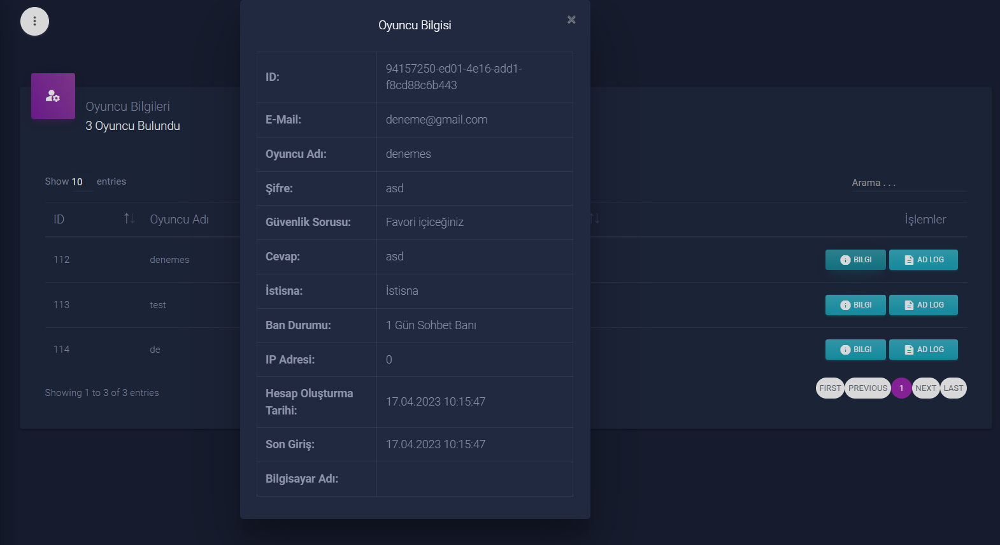
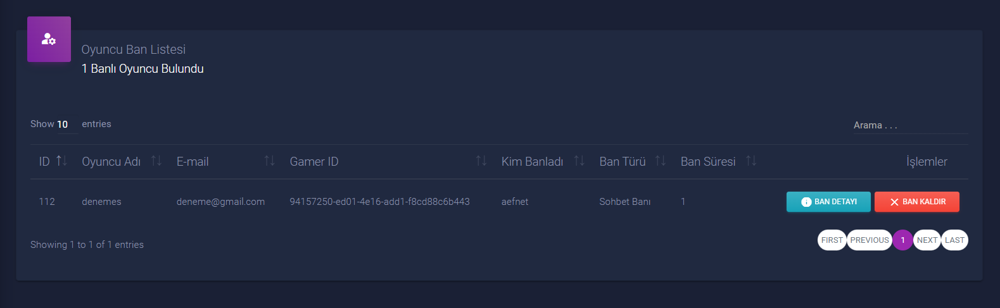
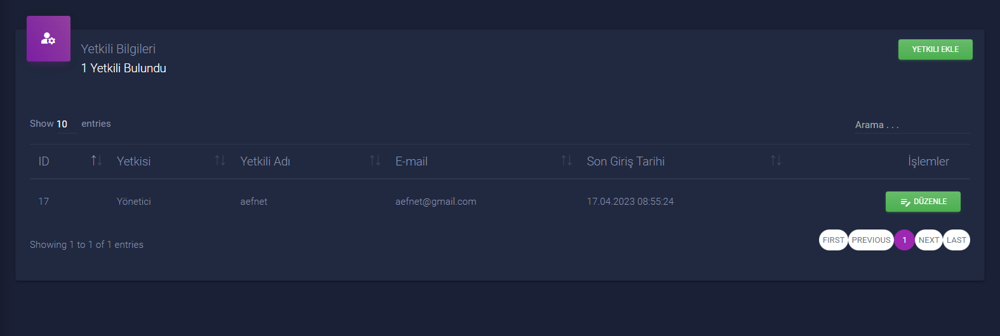

# Aefnet Panel

Aefnet Panel, oyuncu işlemleri, oyuncu ban işlemleri, site ve oyun ayarları, log sistemi, yetkilendirme sistemi gibi özellikleri içeren bir admin panelidir. Bu panel laravel,toastr ve livewire kütüphaneleri kullanılarak geliştirilmiştir.

# Anasayfa

# Oyuncu İşlemleri 

# Oyuncu Ban İşlemleri

# Ayarlar

# Yetkili İşlemleri 

